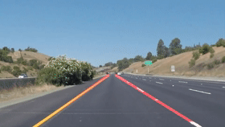
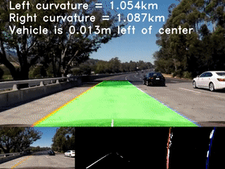
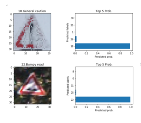
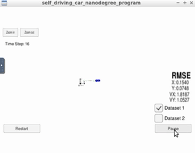
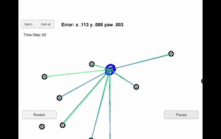
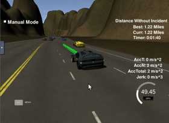
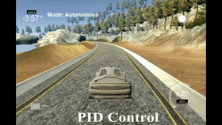
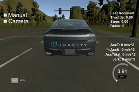

# Self-Driving-Car

In this repository I will gather all my finished codes about the projects of **[Udacity Self-Driving Car Engineer Nanodegree](https://www.udacity.com/course/self-driving-car-engineer-nanodegree--nd013)** . About new version, a total of 9 projects. And after that, I enrolled the Bootcamp of self driving car. I combined all these knowledge to make a real car driving autonomously on the roads with traffic lights.

<table style="width:100%">
  <tr>
    <th>
      

           
            P1: Finding Lane Lines
            <a href="https://github.com/lilyhappily/CarND-Term1-P1-Finding-Lane-Lines" name="p1_code">(code)</a>
      

    </th>
        <th>

           
            P2: Advanced Lane Finding
            <a href="https://github.com/lilyhappily/CarND-Term1-P2-Advanced-Lane-Lines" name="p2_code">(code)</a>
        

    </th>
       <th>

           
            P3: Traffic Signs Classifier
            <a href="https://github.com/lilyhappily/CarND-Term1-P3-Traffic-Sign-Classifier" name="p3_code">(code)</a>
        

    </th>
  </tr>
  <tr>
    <th>

           
            P4: Behavioral Cloning
            <a href="https://github.com/lilyhappily/CarND-Term1-P4-Behavioral-Cloning" name="p4_code">(code)</a>
        

    </th>
        <th>

           
            P5: Extended Kalman Filters
            <a href="https://github.com/lilyhappily/CarND-Term1-P5-EKF" name="p5_code">(code)</a>
        

    </th>
    <th>

           
            P6: Kidnapped Vehicle
            <a href="https://github.com/lilyhappily/CarND-Term2-P1-Kidnapped-Vehicle-and-notes" name="p6_code">(code)</a>
        

    </th>
  </tr>
  <tr>
    <th>

           
            P7: Highway Driving
            <a href="https://github.com/lilyhappily/CarND-Term2-P2-Highway-Driving-and-notes" name="p7_code">(code)</a>
        

    </th>
    <th>

           
            P8: PID Controller
            <a href="https://github.com/lilyhappily/CarND-Term2-P3-PID-Control-and-notes" name="p8_code">(code)</a>
        

    </th>
   <th>

           
            P9: CarND Capstone
            <a href="https://github.com/lilyhappily/CarND-Term2-P6-Capstone" name="p9_code">(code)</a>
        

    </th>
  </tr>
</table>

## Part 1

### Computer Vision, Deep Learning, and Sensor Fusion

In this term, you'll first become an expert in applying Computer Vision and Deep Learning on automotive problems. You will teach the car to detect lane lines, predict steering angle, and more all based on just camera data!

Next, you'll learn Sensor Fusion, or how to use an array of sensor data to perceive the environment around the vehicle.

* Project1:  Finding Lane Lines

  **Summary**: Used sic knowledge of computer vision such as grayscale, Gaussian blur, mask and so on to make a pipeline to detect the straight lines on the road. 

  **Keywords**: Computer vison, OpenCV

- Project2： Advanced Lane Finding

  **Summary**: Used Camera Calibration, Perspective Transform,  fit a polynomial, Compute curvature to built an advanced lane-finding algorithm.

  **Keywords**: Computer vison, OpenCV

- Project3： Traffic Sign Classifier

  **Summary**: Built a deep neural network to classify traffic signs using Pytorch. Data augmentation and resampling to make the model more robust.

  **Keywords**: CNN, Pytorch, Data Argumentation, Resample

- Project4： Behavioral Cloning

  **Summary**: Used a CNN to build a model to predict the steer angle of the vehicle to implement  the task of End to End Learning for Self-Driving Cars.

  **Keywords**: CNN, Keras, Regression

- Project5： Extended Kalman Filters

  **Summary**: Utilizeda Kalman Filter to estimate the state of a moving object of interest with noisy lidar and radar measurements. Obtaining RMSE values to make the model more better.

  **Keywords**: C++, KF, RMSE, Sensor Fusion

## Part 2

### Localization, Path Planning, Control, and System Integration

In this term, you'll expand on your sensor knowledge to localize and control the vehicle. You'll evaluate sensor data from camera, radar, lidar, and GPS, and use these in closed-loop controllers that actuate the vehicle.

After that, you'll learn how to plan where the vehicle should go, and how the vehicle systems work together to get it there.

- Project6： Kidnapped Vehicle

  **Summary**:  Used sensor knowledge to localize and control the vehicle. Evaluating sensor data from camera, radar, lidar, and GPS, and use these in closed-loop controllers that actuate the vehicle.

  **Keywords**:  C++, Localization, Particle Filter

- Project7： Highway Driving

  **Summary**:  Built a path planner that creates smooth, safe trajectory for cars on highway driving. Created a successful path planner which is able to keep inside its lane, avoid hitting other cars, and pass slower moving traffic all by localization, sensor fusion, and map data.

  **Keywords**:  C++, Path planning

- Project8： PID Controller

  **Summary**:  Implement a PID controller for keeping the car on track by appropriately adjusting the steering angle.

  **Keywords**:  C++, PID

- Project9： Programming a Real Self-Driving Car

  **Summary**: Wrote ROS nodes to implement core functionality of the autonomous vehicle system, including traffic light detection, control, and waypoint following! You will test your code using a simulator, and when you are ready, your group can submit the project to be run on Carla.

  **Keywords**:  C++, ROS

## Part 3

### A real car Bootcamp

* Collected the traffic lights dataset on the training site and labeled these image. Used these small images to training a model to classify traffic light by Transfer learning.
* Recoded the Point cloud dataset using Velodyne-16 Lidar to create the PCD Map by Ndt_Mapping.
* Localized the vehicle using the PCD map and Lidar.
* Collected the Waypoints dataset on the site and make the vehicle to autonomously follow the waypoints.
* Combined the traffic lights model to made control strategies.
* Made the vehicle to drive autonomously by itself and made a right decision In front of the traffic lights.

**Keywords**:  C++, ROS, Autoware, Python, Transfer Learning

